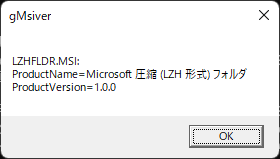

go-msidb
=========

The golang library to get the version of the Windows Installer.

msiver.exe &amp; gmsiver.exe
========================

The tool to get the version of the Windows Installer.

CUI Version:
```
msiver [FILEPATH]
```

GUI Version:

```
gmsiver [FILEPATH]
```

FILEPATH is one of these.

- .MSI file's path
- The Directory path containing .MSI Files
- .ZIP file's path containing .MSI Files

Examples
--------

### (1) msiver

```
$ msiver LZHFLDR.MSI
LZHFLDR.MSI:
ProductName=Microsoft 圧縮 (LZH 形式) フォルダ
ProductVersion=1.0.0
$
```

### (2): msiver -a

```
$ msiver -a LZHFLDR.MSI
LZHFLDR.MSI:
EulaForm_Property=No
ARPCONTACT=Microsoft
VSDVERSIONMSG=この製品の新しいバージョンが既にインストールされているためインストールできません。
UpgradeCode={D89A786A-957F-41EC-A8F9-F4EF2B12397F}
WelcomeForm_NextArgs=EulaForm
VSDNETMSG=このセットアップは .NET Framework バージョン [1] を必要とします。.NET Framework をインストールして、このセットアップをやり直してください。
SFF_NewFldrBtn=NewFldrBtn
EulaForm_PrevArgs=WelcomeForm
AdminMaintenanceForm_Action=Repair
AdminEulaForm_PrevArgs=AdminWelcomeForm
VSDUIANDADVERTISED=このアドバタイズされたアプリケーションは安全でない可能性があるためインストールされません。管理者に連絡してパッケージのインストール ユーザー インターフェイスのオプションを基本に変更してください。
VSDINVALIDURLMSG=指定されたパス '[2]' は使用できません。Internet Information Server が実行されていないか、またはパスが別のコンピュータにリダイレクトされている可能性があります。インターネット サービス マネージャでこの仮想ディレクトリの状態を調べてみてください。
ProductLanguage=1041
AdminEulaForm_Property=No
ErrorDialog=ErrorDialog
Manufacturer=Microsoft
ProductVersion=1.0.0
VSDNETURLMSG=このセットアップは .NET Framework バージョン [1] を必要とします。.NET Framework をインストールして、このセットアップをやり直してください。.NET Framework は、web から取得できます。今すぐ、取得しますか?
ALLUSERS=1
ProductCode={C2B5F332-AAA1-4CBA-84F6-ACFBF458E655}
ProductName=Microsoft 圧縮 (LZH 形式) フォルダ
VSDIISMSG=このセットアップには、Internet Information Server 4.0 またはそれ以降のバージョンとWindows NT 4.0、Windows 2000、または Windows XP が必要です。  This setup cannot be installed on Windows 95、Windows 98、または Windows Me では、このセットアップをインストールできません。Internet Information Server をインストールして、このセットアップを再実行してください。
AdminWelcomeForm_NextArgs=AdminEulaForm
SFF_UpFldrBtn=UpFldrBtn
MaintenanceForm_Action=Repair
DefaultUIFont=VsdDefaultUIFont.524F4245_5254_5341_4C45_534153783400
ARPPRODUCTICON=LZHIcon
ARPHELPLINK=http://go.microsoft.com/fwlink/?LinkId=41656
SecureCustomProperties=NEWERPRODUCTFOUND
$
```

### (3) gMsiver

```
$ gmsiver LZHFLDR.MSI
```



Install
-------

Download the binary package from [Releases](https://github.com/zat-kaoru-hayama/go-msidb/releases) and extract the executable.

### for scoop-installer

```
scoop install https://raw.githubusercontent.com/zat-kaoru-hayama/go-msidb/master/msiver.json
```

or

```
scoop bucket add hymkor https://github.com/hymkor/scoop-bucket
scoop install msiver
```
